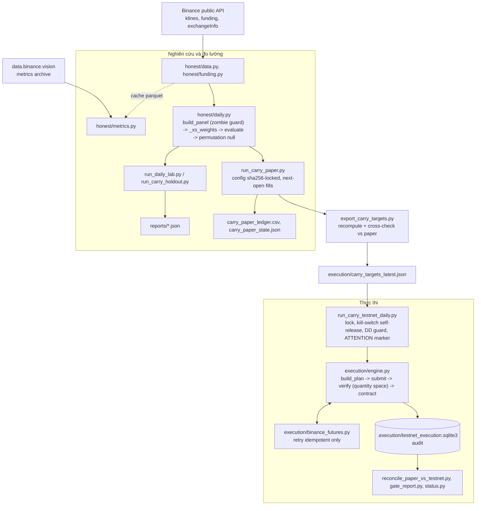

# Binance Analyst
[](.github/workflows/ci.yml) [](https://github.com/MinhNhat-2504/binance-analyst-hybrid-bot/actions/workflows/ci.yml) [](LICENSE)
Bot funding carry cho Binance USDT-M perpetual, kèm harness đo edge chống leakage và engine đặt lệnh fail-closed.

## Demo

Không có giao diện. Đầu ra hằng ngày của bot là một dòng trạng thái và một file target. Ví dụ thật, in bởi `python status.py` ngày 25/09/2026:

```
CARRY-7d status  2026-09-25 07:46 UTC  (14:46 local)
  paper   day 52/60 (target 90)  equity 1.0814 (+8.14%)  sharpe +3.33  maxDD -2.9%  last booked 2026-09-23
  testnet COMPLETE 3/20 needed  last run 2026-09-05  missed (machine off?) 27
  markers none - next scheduled run will proceed
  canary  2026-09-20 (5d ago)  Binance +1.02 vs Bybit +1.43  funding +6.2%/yr  clear
  fills   90 legs  shortfall vs paper open: mean -5.2bps  p90 +62.6bps  (paper assumes ~10)
```

Ví dụ target mà engine nhận mỗi sáng (`execution/carry_targets_latest.json`, rút gọn):

```json
{
  "version": "CARRY_EXECUTION_TARGET_V1",
  "strategy": "CARRY-7d",
  "target_id": "58984bd557cba89ba34b82ff",
  "config_sha256": "25815e02...",
  "signal_time_utc": "2026-09-04T23:59:59.999Z",
  "weights": {"BTCUSDT": -0.0555555556, "PYTHUSDT": -0.0555555556, "SOLUSDT": 0.0625, "ATOMUSDT": 0.0625},
  "reference_prices": {"BTCUSDT": 79616.1, "PYTHUSDT": 0.05436, "SOLUSDT": 101.86, "ATOMUSDT": 1.493}
}
```

## Bài toán

Chiến lược crypto retail thường được chọn bằng backtest, và backtest thường sai vì leakage: nhãn tương lai lọt vào feature, purge theo số dòng thay vì theo thời gian, lọc mẫu bằng kết quả. Phiên bản đầu của repo này (bot scalping 15 phút, XGBoost + LSTM) có profit factor 2.2 đến 2.7 trong backtest và 0.999 khi chạy shadow 4.110 lệnh.

Câu hỏi thật không phải "chiến lược nào lãi" mà "làm sao biết một chiến lược có edge trước khi bỏ tiền". Repo trả lời bằng ba phần: một harness đo edge có permutation null và hold-out tách biệt, một chiến lược rule-based đơn giản đã qua harness đó (CARRY-7d), và một engine đặt lệnh không thể bật tiền thật bằng cờ runtime.

## Kiến trúc



Thành phần:

- `honest/`: đo lường. Tách riêng để mọi ý tưởng mới đi qua cùng một bộ kiểm (null, hold-out, halves, cost stress) và không dính vào code đặt lệnh.
- `clean_research/`: pipeline OOS độc lập thứ hai, ledger một dòng mỗi quyết định. Tách để có một kết luận không dùng chung code với `honest/`.
- `run_carry_paper.py`: executor paper. Tách vì config bị khóa hash và executor từ chối chạy nếu file config đổi; không có knob runtime.
- `export_carry_targets.py`: tầng kiểm soát giữa nghiên cứu và thực thi. Tính lại weight ngày mới nhất, đối chiếu với state paper, từ chối nếu lệch quá 1e-6.
- `run_carry_testnet_daily.py`: vòng lặp không người trực. Tách khỏi engine để engine không biết gì về lịch, lock file hay marker.
- `execution/engine.py`: đặt lệnh và xác minh. Chỉ biết một target file và một policy; mọi bất thường đều kết thúc bằng một status có tên và một dòng audit.
- `execution/contracts.py`: trần vốn đóng băng bằng sha256 của file ceilings; live = 0.
- `gate_report.py`, `status.py`, `reconcile_paper_vs_testnet.py`: chỉ đọc, không đụng sàn.

Code chặn giữa hai tầng: nghiên cứu chỉ được ghi vào file target, engine đọc target và quyết định độc lập bằng code (drift gate, min-notional, kill-switch, verifier).

## Công nghệ sử dụng

| Tầng | Công nghệ | Vì sao chọn |
|---|---|---|
| Data | Binance REST public (`/fapi/v1/klines`, `/fundingRate`, `/exchangeInfo`) | Không cần key, không tốn phí, đủ cho khung ngày. Ràng buộc của dự án là mọi thứ phải miễn phí |
| Data | data.binance.vision metrics archive | REST chỉ giữ 30 ngày open interest và long/short ratio; archive giữ từ 2021-12, đã xác minh khớp REST 0.00% (`honest/metrics.py`) |
| Data | Bybit, OKX public API (`honest/crossex.py`) | Kiểm tra edge có phụ thuộc một sàn không; OKX chỉ có ~90 ngày funding nên bị loại khỏi gate |
| Data | pandas, numpy, pyarrow | Panel ngày x symbol; parquet để cache 75 symbol x 600 ngày không tải lại |
| Model | Rule cross-sectional (rank funding 7 ngày, long/short 20%) | Không train. Sau khi đo được tín hiệu ML 15m chỉ 4.9bps so với phí 12bps, chọn chiến lược mà phí không chi phối |
| Model | scikit-learn, XGBoost | Chỉ còn dùng trong `honest/evaluate.py` và `clean_research/model.py` để đo lại model cũ; không nằm trên đường chạy hằng ngày |
| Model | Permutation null tự viết (`honest/daily.py`, `honest/evaluate.py`) | Column-permutation giữ nguyên autocorrelation, turnover và cost profile, chỉ phá liên kết signal với symbol. Thư viện sẵn có không có null kiểu này |
| Serving | REST client tự viết (`requests` + HMAC) | Không dùng SDK để kiểm soát từng request: retry chỉ cho GET/DELETE, không bao giờ retry POST đặt lệnh, resync giờ khi gặp lỗi -1021 |
| Storage | SQLite (`.execution/*.sqlite3`) | Audit một file, không cần server, đọc được bằng `sqlite3` khi engine đã chết |
| Storage | JSON + sha256 (config, ceilings, target) | Khóa bằng hash để tune giữa chừng phải là một commit có review, không phải một lần sửa file |
| Infra | Windows Task Scheduler + `run_hidden.vbs` | Máy của tác giả là laptop Windows. Sự cố 31/08 (console bị đóng làm chết process) là lý do chạy ẩn qua vbs |
| Testing | pytest, 189 test | Fake exchange (`TrackingClient`) thay đổi inventory chỉ khi lệnh khớp thật, nên test được cả đường flatten và halt |

## Cách chạy

Yêu cầu: Python 3.11 (đã chạy trên 3.11.9), Windows cho phần lịch tự động; phần nghiên cứu và paper chạy được trên mọi hệ điều hành. Không có Dockerfile.

```bash
git clone https://github.com/MinhNhat-2504/binance-analyst-hybrid-bot
cd binance-analyst-hybrid-bot
pip install -r requirements.txt
```

Nghiên cứu và paper không cần key:

```bash
python run_honest_harness.py --quick   # đo lại tín hiệu 15m cũ (kết luận: không có edge)
python run_daily_lab.py                # lab khung ngày, mỗi cell so với null riêng, ~10 phút lần đầu
python run_carry_holdout.py            # CARRY-7d trên 33 symbol hold-out
python run_carry_paper.py              # book paper ngày hôm nay; bỏ vài ngày nó tự bù
pytest                                 # 189 test, ~1 phút
```

Testnet cần key Binance Demo Trading. Tạo file `.env.testnet` (đã gitignore) với ba biến:

```
BINANCE_TESTNET_API_KEY=
BINANCE_TESTNET_API_SECRET=
BINANCE_TESTNET_HOST=demo
```

Loader chỉ đọc đúng ba tên này, cố ý bỏ qua `BINANCE_API_*` để key production trong shell không bị dùng nhầm. Kiểm tra key và chạy tay một ngày:

```bash
python run_testnet_execution.py --check-credentials
python export_carry_targets.py
python run_testnet_execution.py --plan                       # xem từng leg, không đặt lệnh
python run_testnet_execution.py --release-kill-switch "manual" --authorize-budget-usd 2000
python run_testnet_execution.py --execute --budget-usd 2000 --confirm-testnet I_ACCEPT_TESTNET_ORDERS
python reconcile_paper_vs_testnet.py
```

Chạy tự động mỗi sáng: bấm đúp `INSTALL_TASKS.bat` (tạo ba task Windows: paper 07:05, testnet 07:20, canary Chủ nhật 08:00, bật wake timer). Đường dẫn Python và thư mục dự án đang hardcode trong các file `.bat`; máy khác phải sửa hai đường dẫn đó.

Live: `run_live_execution.py` tồn tại nhưng trả về mã 2 "NOT AUTHORIZED" chừng nào `execution_ceilings_v1.json` còn ghi `live: 0.0`. Không có cờ nào bật được.

## Kết quả và đánh giá

Mọi số dưới đây có file gốc trong `reports/` hoặc ledger trong repo.

**CARRY-7d, backtest** (`reports/carry_holdout_report.json`, cửa sổ 600 ngày kết thúc 2026-07-31, phí 10bps mỗi chân, fill ở open ngày kế tiếp):

| | Discovery (42 symbol, 592 ngày) | Hold-out (33 symbol tách rời, 587 ngày) |
|---|---:|---:|
| Sharpe | 1.78 | 1.85 |
| Lợi nhuận/năm | +32.8% | +38.4% |
| Max drawdown | -14.7% | -12.5% |
| Sharpe khi phí 20bps | 1.20 | 1.31 |
| p-value, column-permutation null (200 lần) | 0.005 | 0.005 |
| Sharpe hai nửa | 1.77 / 1.80 | 2.57 / 1.43 |

**Cross-exchange** (`reports/crossex_lab_report.json`, 577 ngày chung): weight từ funding Binance áp lên giá Bybit giữ Sharpe 1.61 / 1.70; weight từ funding Bybit chỉ 1.09 / -0.35. Edge nằm ở thông tin trong funding Binance, không phải "funding nói chung".

**Pipeline OOS độc lập** (`CLEAN_OOS_FINDINGS.md`, `clean_research/`): CARRY-7d có PnL replay dương sau phí, nhưng CI 95% của các khối sau cutoff cắt 0 và double-holdout không thắng null. Hai bộ đo trong repo không đồng ý về độ mạnh của bằng chứng; bộ nghiêm hơn nói "chưa đủ". Điều này được ghi nhận, không được che.

**Paper trading** (`carry_paper_ledger.csv`, từ 2026-08-03): ngày 52/60, +8.14%, Sharpe annualized 3.33, max drawdown -2.9%. Độ lệch chuẩn ngày 0.70% nên 1 sigma một tháng khoảng 3.8%; 52 ngày chưa đủ để kết luận.

**Testnet** (`.execution/testnet_execution.sqlite3`, `execution_quality.csv`): 3 ngày COMPLETE, 90 lệnh khớp thật. Shortfall so với giá open paper giả định: trung bình -5.2bps, trung vị +3.7bps, p90 +62.6bps. Phí thật trên sàn demo: taker 4bps, maker 2bps, thấp hơn giả định 10bps.

**Bot 15m cũ** (`reports/honest_harness_CLEAN.json`, 131 feature, 540 ngày, 8 fold, 20 permutation): SHORT hơn null +4.94bps, p=0.19; LONG +0.85bps, p=0.476; phí khả thi thấp nhất 12bps. Đã đóng.

**Các hướng đã đo và đóng** (`HONEST_FINDINGS.md`): rebalance 8h (Sharpe 0.84 so với 1.85), basis carry spot-perp (funding không vượt phí 4 chân), vol-targeting overlay (ngày tệ nhất luôn tệ hơn).

Cổng bật live được ghi trước trong `carry_paper_config_v1.json` và chấm bằng `gate_report.py` (13 điều kiện). Kết quả ngày 25/09: NOT-YET, thiếu ngày paper và 17 lần testnet COMPLETE.

## Các quyết định thiết kế chính

- **Quyết định**: khóa config paper bằng sha256, executor từ chối chạy nếu file đổi, thay vì cho phép chỉnh tham số.
  **Vì**: tune giữa chừng là chính cơ chế đã tạo ra profit factor 2.69 giả ở bản đầu. Một record 60 ngày của luật bị sửa dọc đường không chứng minh gì.
  **Đánh đổi**: phát hiện lỗi thật trong config cũng phải chờ hết kỳ paper hoặc chấp nhận reset đồng hồ.

- **Quyết định**: engine chỉ tự thanh lý khi vị thế sai so với contract; mọi bất thường khác (mất mạng, lệnh chờ lạ, không ghi được audit) dừng lại và giữ nguyên rổ.
  **Vì**: "không biết" khác "sai". Sự cố 05/09 chứng minh ngược lại: một lỗi SSL thoáng qua đã thanh lý cả rổ đúng.
  **Đánh đổi**: nhiều trạng thái kết thúc cần người đọc runbook (13 status), và một rổ lệch có thể nằm qua đêm chờ người xử lý.

- **Quyết định**: verifier so vị thế trong không gian quantity (số coin, làm tròn theo stepSize) thay vì notional.
  **Vì**: notional đổi theo giá mark từng giây; quantity là thứ sàn thật sự giữ. Tolerance tính từ stepSize và minNotional của từng symbol.
  **Đánh đổi**: phải tải và cache exchangeInfo, và phải xử lý riêng va chạm giữa trần một lệnh và minNotional (sự cố 04/09).

- **Quyết định**: giới hạn nghiên cứu 3 họ chiến lược mỗi quý, đăng ký trước grid, null và luật quyết định (`RESEARCH_PREREG_Q4_2026.md`).
  **Vì**: mỗi cell thêm vào làm mòn ý nghĩa thống kê của toàn bộ; quét đủ nhiều rồi giữ cell đẹp nhất là cách tạo kết quả giả.
  **Đánh đổi**: có ý tưởng hay giữa quý cũng phải chờ; kết quả âm chiếm slot như kết quả dương.

- **Quyết định**: live bị khóa ở hai tầng (file ceilings `live: 0.0` được hash vào contract, và hằng số `ABSOLUTE_GROSS_UPPER_BOUND_USD = 5000` trong code) thay vì một biến môi trường.
  **Vì**: bật tiền thật phải là một commit có review, làm đỏ một test viết riêng để báo, không phải một lần export biến.
  **Đánh đổi**: chuyển sang live cần sửa test và file ceilings, mất khoảng một buổi.

## Hạn chế và việc làm tiếp

Hạn chế đọc từ code:

1. Hai bộ đo trong repo mâu thuẫn về CARRY-7d: `honest/` cho p=0.005, `clean_research/` cho CI cắt 0 và double-holdout không thắng null. Chưa có phân tích vì sao hai pipeline khác kết luận.
2. Bằng chứng thực thi mỏng: 3 ngày testnet COMPLETE và 90 lệnh; shortfall có độ lệch chuẩn 67bps nên sai số chuẩn của trung bình khoảng 7bps, chưa phân biệt được phí thật 5bps hay 20bps. Tháng 9 mất 20 ngày testnet vì marker ATTENTION nằm trong thư mục ẩn không ai nhìn.
3. Canary signal-health ba tuần liền nghiêng về Bybit (Sharpe theo weight Binance trên 180 ngày giảm 1.60 xuống 1.02). Chưa có luật tự động nào dừng paper khi canary xấu đi; quyết định vẫn thủ công.
4. Phụ thuộc Windows: lịch chạy bằng Task Scheduler, đường dẫn Python và thư mục hardcode trong bốn file `.bat`, chạy ẩn qua `run_hidden.vbs`. Không có Docker, không chạy được trên server Linux nếu không viết lại phần lịch.
5. Không có unattended live runner. `run_live_execution.py` là CLI thủ công; tháng đầu live (nếu có) phải gõ tay mỗi sáng.
6. Order style `MAKER_THEN_MARKET` đã viết và test nhưng chưa từng chạy trên sàn; mặc định vẫn MARKET. Tổng thời gian chờ maker bị chặn ở nửa TTL kill-switch, chưa đo trên fill thật.
7. Universe 42 symbol cố định từ tháng 8; MKRUSDT và TONUSDT đã SETTLING trên live, được zombie guard loại nhưng chưa có cơ chế thay symbol.
8. Sáu symbol trả funding mỗi 4h (TIA, ENA, JTO, PYTH, TAO, ORDI) trong khi paper giả định 3 kỳ mỗi ngày. Là một nguồn lệch paper so với live đã biết, chưa đo.

Việc làm tiếp, theo thứ tự:

1. Đủ 20 ngày testnet COMPLETE trước mốc ngày 90 (01/11/2026) để cổng chấm được phần thực thi; mọi thứ khác phụ thuộc vào đây.
2. Chạy ba cell Q4 đã đăng ký từ 01/10 (hysteresis cho carry, low-vol cross-section có hedge beta, phân kỳ top-trader với đám đông) trên dữ liệu `honest/metrics.py` đã cache.
3. Đối chiếu `honest/` với `clean_research/` trên cùng snapshot để giải thích vì sao hai bộ đo không đồng ý về CARRY-7d.

## Cấu trúc thư mục

```
honest/                     harness đo edge: data, features, labels, cv, evaluate, execution sim, funding, daily lab, basis, crossex, metrics
clean_research/             pipeline OOS độc lập: schema, ledger, model, carry, intraday_carry
execution/                  engine đặt lệnh, REST client, contracts (ceilings sha256), targets
tests/                      189 test; TrackingClient là fake exchange
reports/                    JSON kết quả của mọi lab; bằng chứng cho HONEST_FINDINGS.md
archive/legacy_15m/         bot 15m cũ, giữ nguyên để đối chiếu; không tin số trong đó
run_daily_lab.py            grid khung ngày đăng ký trước (UNIVERSE 42)
run_carry_holdout.py        CARRY-7d trên HOLDOUT_UNIVERSE 33
run_carry_paper.py          executor paper, config khóa hash
export_carry_targets.py     nghiên cứu -> target file, có cross-check
run_carry_testnet_daily.py  vòng lặp không người trực (lock, self-release, DD guard, marker)
run_testnet_execution.py    CLI testnet thủ công (--plan, --execute)
run_live_execution.py       CLI live, trơ khi ceilings live = 0
gate_report.py              chấm 13 điều kiện cổng ngày 60/90
status.py                   6 dòng tình trạng; ghi ra Desktop mỗi sáng
check_live_filters.py       sàn thật nhận rổ ở vốn tối thiểu bao nhiêu (không cần key)
collect_daily_snapshots.py  gom OI, long/short ratio, taker flow mỗi ngày (data_snapshots/, không commit)
run_canaries.py             signal-health và funding-regime hằng tuần
notify_markers.py           có marker -> file trên Desktop
carry_paper_config_v1.json  luật CARRY-7d và cổng, sha256-locked
execution_ceilings_v1.json  trần vốn: testnet 2000, live 0
HONEST_FINDINGS.md          vì sao bot 15m không có edge, và mọi hướng đã đóng
EXECUTION_RUNBOOK.md        bảng status và việc phải làm
GO_LIVE_CHECKLIST.md        khung vốn, cổng, tiêu chí dừng, lịch
RESEARCH_PREREG_Q4_2026.md  ba cell tháng 10, khóa trước khi chạy
```

## Ghi nhận và giấy phép

- Dữ liệu: Binance USDT-M Futures public REST và data.binance.vision; Bybit v5 và OKX public API cho kiểm tra cross-exchange. Không dùng dữ liệu trả phí.
- Không có model gốc bên ngoài; model 15m cũ tự train và đã archive.
- Thư viện: pandas, numpy, pyarrow, requests, scikit-learn, XGBoost, joblib, pytest.
- Giấy phép: MIT, xem file `LICENSE`.

Repo phục vụ nghiên cứu. Funding carry vẫn lỗ nặng được khi thị trường squeeze; ai bật live tự chịu trách nhiệm.

Trịnh Ngọc Minh Nhật
